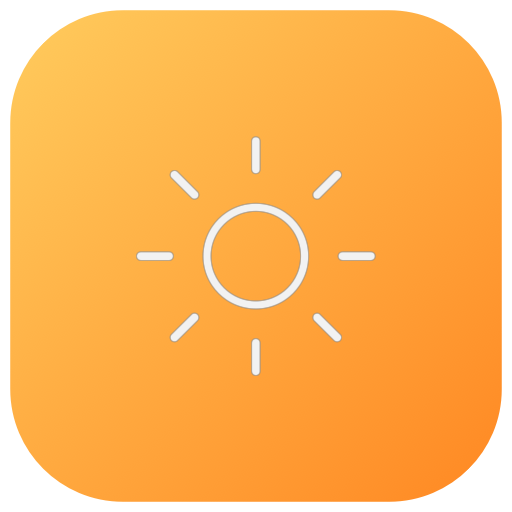
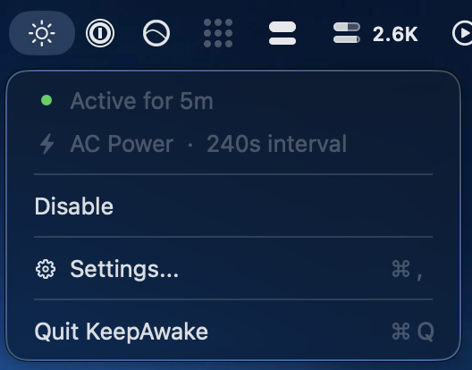
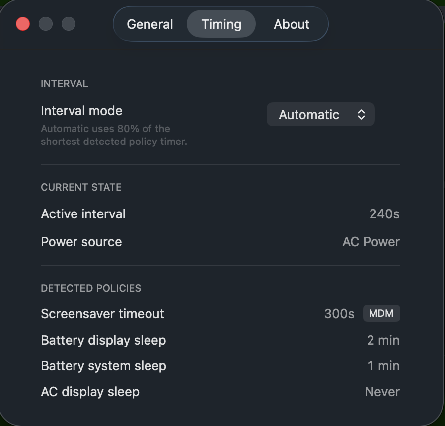

<p align="center">
  
</p>

<h1 align="center">KeepAwake</h1>

<p align="center">
  A native macOS menu bar app that prevents Jamf-managed screen lock by simulating user activity.
</p>

<p align="center">
  
  &nbsp;&nbsp;
  
</p>

Tools like `caffeinate`, Amphetamine, and KeepingYouAwake only prevent **system sleep** via IOKit assertions. They do **not** stop the **screensaver lock** enforced by Jamf configuration profiles. KeepAwake simulates a real `fn` keypress via System Events, which resets the `HIDIdleTime` counter that the screensaver daemon actually monitors.

## Install

Homebrew is the recommended install path:

```bash
brew install --cask yashiels/tap/keepawake
```

Direct downloads are available from the [latest GitHub release](https://github.com/yashiels/keep-awake/releases/latest).

Build from source:

```bash
make run        # build and launch
make install    # copy to /Applications
make dmg        # create DMG installer
```

## What It Does

KeepAwake's menu bar shows live status and adapts automatically:

- Sun icon when active, moon when paused. Click for uptime, power source, interval, and quick toggle.
- Real-time power source detection via IOKit callbacks — interval adjusts instantly when you plug in or unplug, even while the menu is open.
- Auto-detects MDM screensaver profiles at `/Library/Managed Preferences` and parses `pmset` power timers.
- Calculates 80% of the shortest detected timer as the keep-alive interval, clamped between 10s and 300s.
- Sends `fn` key (key code 63) via CGEvent — no visible effect, no modifier conflict, no subprocess.
- Holds an IOKit display sleep assertion to prevent display sleep independently.
- **Auto-pauses when screen is locked** — stops ticking and releases the display assertion while the screen is locked, resumes immediately on unlock.
- **Idle detection override** — optionally skips fake keypresses while you're actively typing or using the mouse, only simulating when you're truly idle.
- **Battery threshold auto-disable** — pauses keep-awake when battery drops below a configurable threshold (5–50%), with 5% hysteresis to prevent toggling.

## Settings

The native Settings window has three tabs:

- **General** — Start active on launch, Launch at Login, pause when screen is locked, power change notifications, battery threshold with slider, skip tick when user is active, quit.
- **Timing** — Switch between Automatic and Manual interval modes. Manual lets you set a custom interval (10–300s). Changes take effect immediately on the running timer. Detected MDM policies and pmset timers are displayed.
- **About** — Version, update checker (checks GitHub releases), project link.

## How It Works

Each tick follows these steps:

1. **Detect** — Read MDM screensaver profile and pmset sleep timers.
2. **Calculate** — Pick the shortest timer, fire at 80% of that value.
3. **Guard** — Check screen lock state, battery level, and user activity before proceeding.
4. **Simulate** — Send `fn` keypress via CGEvent to reset HIDIdleTime.
5. **Adapt** — IOKit callback detects power source change, adjust interval instantly.

## Privacy

Zero analytics. Zero telemetry. No network calls except optional GitHub update checks. Reads only managed preferences and power state. Requires Accessibility access for System Events key simulation. No Full Disk Access. No admin rights needed.

## Development

KeepAwake is a SwiftPM-based macOS menu bar app.

Requirements:

- macOS 14+
- Swift 5.9+
- Apple Silicon

```bash
make build      # compile release binary
make test       # run unit tests (parallel)
make bundle     # create signed .app bundle
make dmg        # create DMG installer
make release    # create release DMG with SHA256
make clean      # remove build artifacts
```

Releases are automated via GitHub Actions. Go to **Actions > Ship**, pick `patch`, `minor`, or `major` — it bumps the version, builds, tests, creates a DMG, publishes a GitHub release, and updates the [Homebrew tap](https://github.com/yashiels/homebrew-tap).

## Project Layout

- `Sources/KeepAwake/` — App entry point, menu bar controller, settings window, preferences panes.
- `Sources/KeepAwake/KeepAwakeManager.swift` — Core timer, power source monitoring, activity simulation.
- `Sources/KeepAwake/PolicyDetector.swift` — MDM profile and pmset parser.
- `Sources/KeepAwake/SettingsStore.swift` — Observable settings with UserDefaults persistence.
- `Tests/KeepAwakeTests/` — Unit tests for manager, policy detector, and settings.
- `docs/` — Marketing website (GitHub Pages).
- `scripts/` — Shell script alternative and icon generator.

## Shell Script

A lightweight shell script alternative is available in `scripts/keep-awake.sh` for environments where installing an app isn't practical.

## License

MIT. See [LICENSE](LICENSE).
